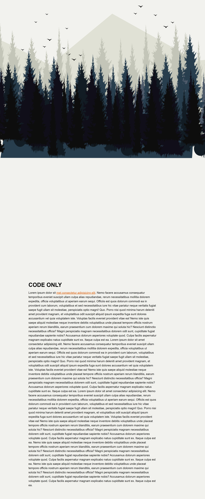

# Awesome parallax effect on scroll

During this task, I worked with CSS animations as well as animations in JavaScript. It was interesting to learn new tricks in JS, and I will definitely implement pieces of code from this task in my next projects. 

## Table of contents

  - [The challenge](#the-challenge)
  - [Links](#links)
  - [Built with](#built-with)
  - [Screenshot](#screenshot)

### The challenge

Users should be able to:

- See a parallax effect on scroll
- View the optimal layout for the interface depending on their device's screen size
- See hover and focus states for all interactive elements on the page

### Links

- Solution URL: (https://github.com/olenahelena/parallax-effect-on-scroll.)
- Live Site URL: (https://scintillating-medovik-3b04a2.netlify.app/)

### Built with

- Semantic HTML5 markup
- SCSS custom properties
- JavaScript

### Screenshot

